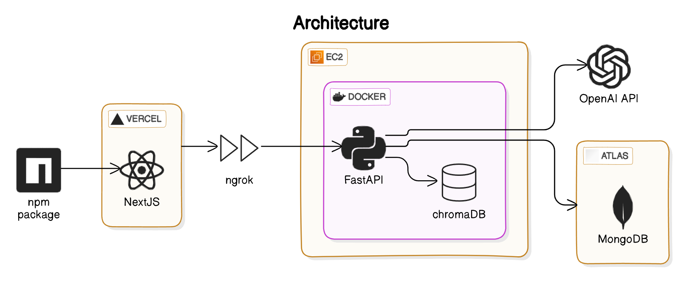
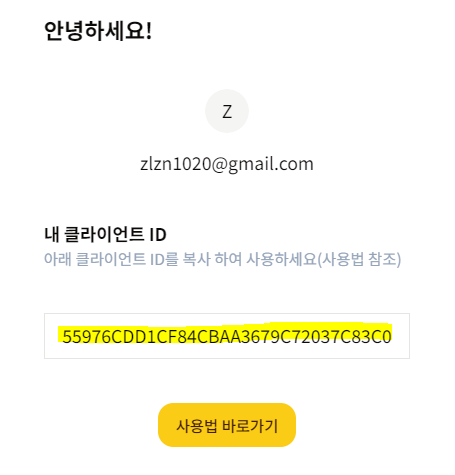
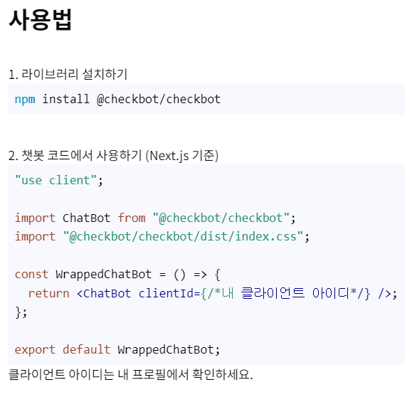

<h1 align="center">
  <br>
  
  <br>
  췍봇(CheckBot)
  <br>
</h1>

<h4 align="center">웹사이트에 쉽게 연동가능한 맞춤형 AI 비서🤖</h4>

## 👀 둘러보세요

[웹사이트](https://capstone-2024-37.vercel.app)

## 💬 프로젝트 소개

> "상황에 맞는 chatbot을 간편하게 생성하고 사용할 수 있을까?”

최근 ai 시장의 규모가 커지게 되면서 부동의 애플의 주식이 하락하는 등 여러 곳에서 ai에 대한 관심도가 상당히 높아졌다. 그중 GPT를 제작한 회사 open ai에 큰 관심이 쏠리게 되었다. 많은 기업, 사람들은 기존의 챗봇이 아닌 사용자 맞춤 챗봇을 원하기 시작하였다.

이번 프로젝트의 목표는 ai에 대해 관심이 없더라도 쉽게 구성 할 수 있는 챗봇의 구현과 구현된 챗봇을 쉽게 본인의 서비스, 회사에 적용 가능한 SDK 구현에 초점을 맞췄다.

<br/>

Recently, as the size of the ai market has increased, interest in ai has increased considerably in many places, including the decline in Apple's stock. Among them, great attention has been paid to open ai, the company that produced GPT. Many companies and people are starting to want user-customized chatbots rather than traditional chatbots.

The goal of this project is to implement a chatbot that can be easily configured even if you are not interested in ai, and to implement SDK that can easily apply the implemented chatbot to your own service and company.

<br/>

### 📋 주요 기능 소개

- 누구나 맞춤형 챗봇을 생성하고 사용할 수 있습니다.
- 간단한 키워드, pdf정보로 챗봇을 제작할 수 있습니다.
- 챗봇을 생성하고 자신의 서비스, 웹 사이트에 넣을 수 있습니다.

### 🚢 기대효과

1️⃣ 기업에 맞는 챗봇 쉽게 생성

2️⃣ 인력, 서버 등 추가 비용 없이 간편 제작

3️⃣ 기업형 챗봇 제작 시간 감소

<br/>

## 💻 시스템 구성도


### 📹 소개 영상
[](https://www.youtube.com/watch?v=kDxBiVCF_AE)


## 👋 Who we are?

### 고강현

- student ID: \*\*\*\*1548
- E-mail: rhrkdgus1020@naver.com
- Role: AI / Backend / TeamLead

### 구형모

- student ID: \*\*\*\*1551
- E-mail: chrisais9@naver.com
- Role: Frontend / DevOps / PM

### 곽다윗

- student ID: \*\*\*\*1550
- E-mail: dawit0905@gmail.com
- Role: Backend / DevOps

### 김은수

- student ID: \*\*\*\*1568
- E-mail: godong9985@gmail.com
- Role: AI / Frontend

## ✏️ How to use?

### local setting 방법

### 1. git clone

```shell
git clone https://github.com/kookmin-sw/capstone-2024-37.git
```

### 2. .env setting
```shell
cd capstone-2024-37/server/b2b
```
위 경로에 .env파일을 생성한다.

### 3. server start
```shell
cd capstone-2024-37/server
docker build -t {image name} .
docker run --name {image name} -d --rm -p 9000:9000 {container name}
```

### 4. client start
```shell
cd capstone-2024-37/server
yarn install
yarn start or yarn starts
```

### 5. 접속 및 사용 
```
localhost:3000
```

### 기업에 제작한 췍봇 적용 방법

### 1. client id 가져오기


- profile 클릭



- 노란색으로 밑줄친 부분의 본인 client id 복사
- 사용법 바로가기 클릭



- 사용법에 적혀있는 대로 실행
  - 패키지 설치
  - 코드 복사 붙여넣기
